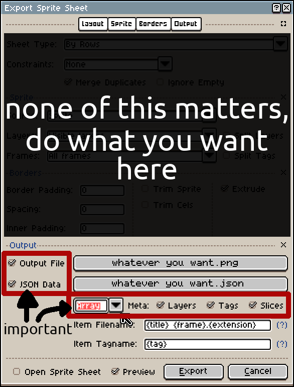

# Asset Bundles
You may want to load entire collections of assets at once, like if you start a new level and need all the sprites/fonts/
textures/... associated with that level. In this case you may want to use an asset bundle. An asset bundle is any
directory or archive that contains a `manifest.json` at the root of that directory/archive (We'll get into the manifest)
in a moment. The images, shaders (extension `.slang`/`.shader`), and audio from that source (recursively) will be loaded automatically and compound types (sprites,
fonts, etc...) will be loaded from either information contained in `manifest.json` or from neighboring files ([scroll
down](#importing-sprites]) to see how you can automatically load sprites). All of those assets will then be made
available through the function `oct_GetAsset(Oct_AssetBundle bundle, const char *name)`.

To load an asset bundle, use

```c
Oct_AssetBundle bundle = oct_LoadAssetBundle("data.zip");
```

From here you may grab assets whenever you like via `oct_GetAsset(Oct_AssetBundle bundle, const char *name)`. 

**Warning** When you create an asset bundle, it queues the creation from the logic thread to then be loaded on the render
thread. `oct_LoadAssetBundle` is *NOT* blocking, but it is blocking on the render thread, and if you attempt to get an
asset from the bundle before it is done loading it will be blocking. For small amounts of assets you can likely ignore
this quirk as it will likely just end up being a one-time <100ms cost, but if you have large amounts of assets in a
single bundle its worth keeping in mind.

## manifest.json
In the manifest you may specify an exclude list (directories, images, and sounds that will not be automatically loaded),
fonts, bitmap fonts, and sprites. Here is an example of one:

```json
{
  "exclude":
          [
            "monogram.png",
            "directory"
          ],
  "fonts":
          [
            {
              "name": "ttf_ubuntu",
              "files": ["Ubuntu-Regular.ttf"]
            }
          ],
  "bitmap fonts":
          [
            {
              "name": "monogram",
              "image": "monogram.png",
              "cell size": [6, 12],
              "unicode range": [32, 128]
            }
          ],
  "font atlases":
          [
            {
              "name": "fnt_ubuntu",
              "font": "ttf_ubuntu",
              "size": 20,
              "unicode ranges": [[32, 128], [1024, 1279]]
            }
          ],
  "sprites":
          [
            {
              "name": "paladin from manifest",
              "texture":  "sprites/paladinsfull.png",
              "frame count": 4,
              "repeat": true,
              "fps": 10,
              "start position":  [0, 0],
              "frame size": [32, 32],
              "padding":  [0, 0],
              "x stop": 0
            }
          ]
}
```

The json parser is very strict, but it will tell exactly what's wrong if something is incorrect. Sprites do not need
to specify every field, but name, texture, frame count, and frame size are required, everything else will choose sensible
defaults. Font atlases may specify any number of Unicode ranges (where as if you create them at runtime without a bundle
you'd need to load each range separately). In the above example, the font `fnt_ubuntu` will be created with 2 separate
atlases internally for the two Unicode ranges specified (latin and cyrillic character sets).

## Importing Sprites
When you load an asset bundle from a directory or archive, the asset parser will automatically search for jsons that
contain spritesheet information. This kind of json will have the format:

```json
{ 
  "frames": 
  [
    {}
  ],
  
  "meta": 
  {
    "image": "IMAGE_FILENAME.png"
  }
}
```

These jsons can be automatically exported by some image editing programs like Aseprite. The asset parser will load 
textures first, so if it finds the associated image it will load the frames specified as a sprite. You will need to 
export sprites in a certain way in Aseprite for this to work, however.



As long as the image and json are in the same directory and you follow the above image, Octarine will load your sprites
automatically under the name of the json.

For example, if you have

    paladinspr.png
    paladinspr.json

You would load the sprite in code with

```c
Oct_Sprite paladin_sprite = oct_GetAsset(asset_bundle, "paladinspr.json");
```