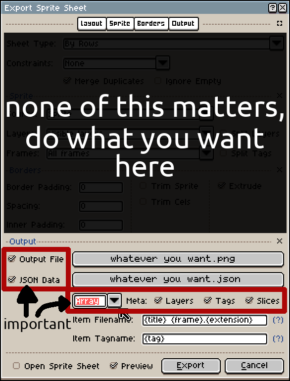

# Importing Sprites
When you load an asset bundle from a directory or archive, the asset parser will automatically search for jsons that
contain spritesheet information. This kind of json will have the format:

```json
{ 
  "frames": 
  [
    ...
  ],
  
  "meta": 
  {
    ...
    "image": "IMAGE_FILENAME.png",
    ...
  }
}
```

The asset parser will load textures first, so if it finds the associated image it will load the frames specified as
a sprite. You will need to export sprites in a certain way in Aseprite for this to work, however.



As long as the image and json are in the same directory and you follow the above image, Octarine will load your sprites
automatically under the name of the json.

For example, if you have

    paladinspr.png
    paladinspr.json

You would load the sprite in code with

```c
Oct_Sprite paladin_sprite = oct_GetAsset(asset_bundle, "paladinspr.json");
```